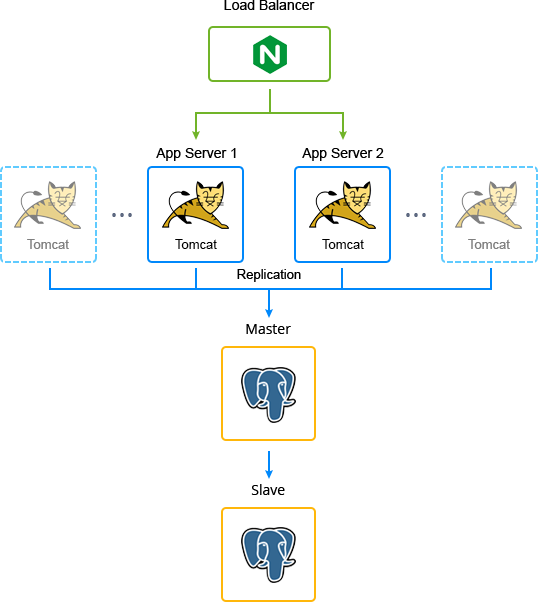
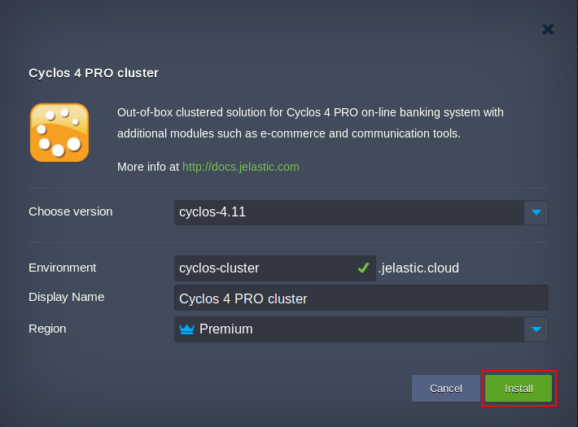
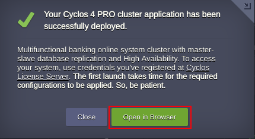

 

# Cyclos Cluster Installation for High Availability of Online Banking Systems

[Cyclos](https://www.cyclos.org/) in Jelastic is a complete online banking system, that is packaged as an advanced highly reliable and auto-scalable cluster on the top of certified dockerized stack templates with the following topology:

- **NGINX** load balancer
- Scalable **Tomcat** application servers with preconfigured [automatic horizontal scaling](https://docs.jelastic.com/automatic-horizontal-scaling) to handle load spikes
- **PostgreSQL** database cluster with primary-secondary (previously known as master-slave) replication to ensure high performance, fault tolerance and data security

 

More details can be found at the article [Cyclos Cluster Installation for High Availability of Online Banking Systems](https://jelastic.com/blog/cyclos-cluster-automatic-installation/).

### Deployment to the Cloud
Click the Deploy button below, specify your email address within the widget, choose one of the [Jelastic Public Cloud providers](https://jelastic.com/install-application/?manifest=https://raw.githubusercontent.com/jelastic-jps/cyclos/master/cyclos-4-cluster/manifest.jps&keys=app.jelastic.eapps.com;app.cloud.hostnet.nl;app.jelastichosting.nl;app.appengine.flow.ch;app.jelasticlw.com.br;app.mircloud.host;app.jcs.opusinteractive.io;app.paas.quarinet.eu) and press **Install**.

**Note**: If you are already registered at Jelastic, you can deploy this cluster by importing the package manifest raw link: 
https://raw.githubusercontent.com/jelastic-jps/cyclos/master/cyclos-4-cluster/manifest.jps within the dashboard.

## Installation Process
In the opened confirmation window at Jelastic dashboard choose the *Cyclos version*, type the *Environment* name, optionally, customize its [Display Name](https://docs.jelastic.com/environment-aliases). Then, select the preferable [region](https://docs.jelastic.com/environment-regions) (if several are available) and click on **Install**.

 

When the deployment is finished, you’ll see the appropriate success pop-up.

 

Now you can just click on the **Open in browser** button within the shown frame and start using your highly available and reliable Cyclos cluster.

**Note**: Once you have initialized Cyclos and created a new network it is mandatory to restart application server nodes.

## Cyclos 4 PRO Managed Hosting Business
To start offering this solution to your customers please follow to [Auto-Scalable Clusters for Managed Cloud Business](https://jelastic.com/apaas/)
